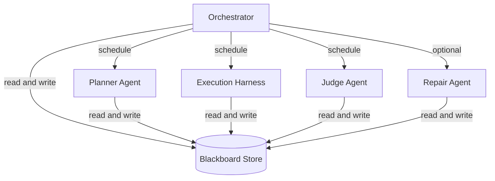
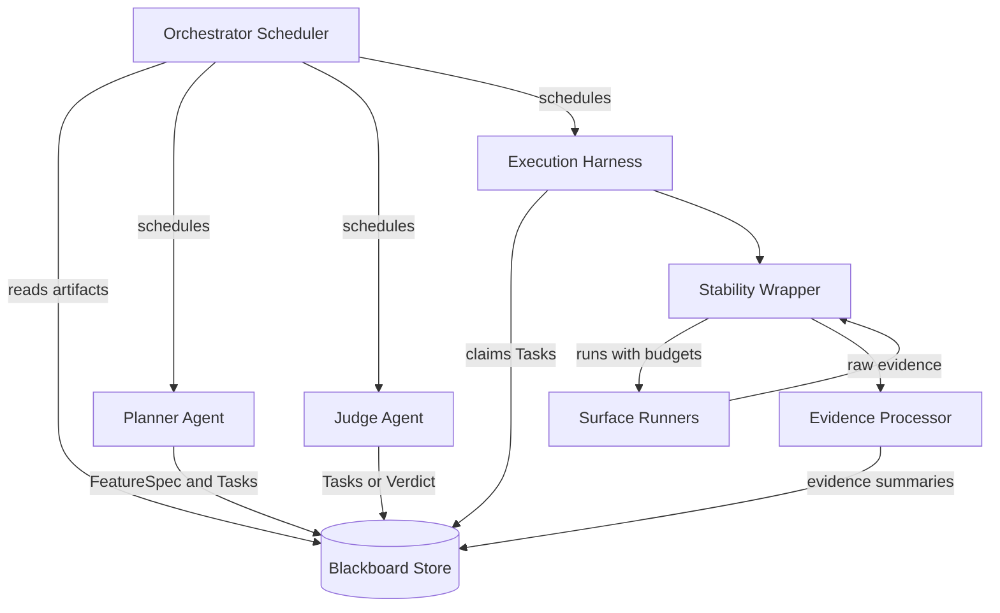
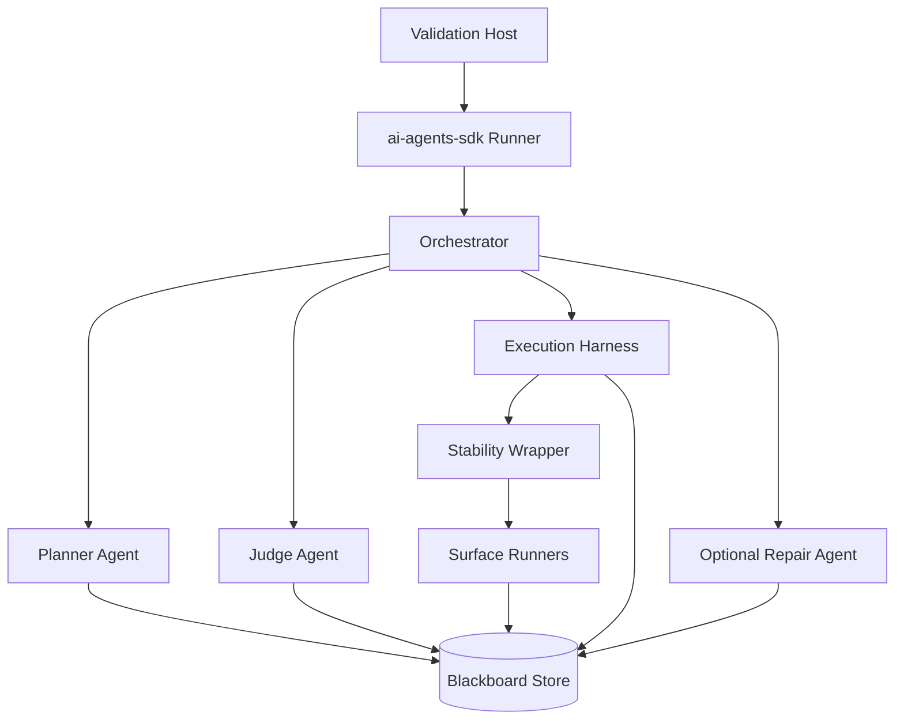

# Validation App: Local Multi-Agent Feature Validation (Design Doc)

## Summary

This system validates an arbitrary software feature from an end-user perspective using a multi-agent loop. It runs locally (not against real staging) and supports four target surfaces: web, macOS desktop apps (Electron or native), iOS, and API. The source of truth is a general text description of the feature and its definition of done.

The chosen architecture is:
- Control plane: single orchestrator with specialist agents
- Shared state: blackboard store that all agents read and write
- Execution: by-surface executors and runners, including sandbox and environment provisioning per run
- Critique and judgment: adversarial validator vs breaker vs judge (evidence-only)
- Reliability: stability wrapper prevents flake-driven infinite loops

MVP decomposition:
- LLM agents: planner + judge.
- Deterministic subsystems: execution harness, stability wrapper, evidence processor, blackboard.

## Goals

- Validate a feature "works for an end user" with a replayable evidence bundle (environment snapshot + action trace + artifacts).
- Produce an explicit verdict: `pass`, `fail`, or `cannot_verify`.
- Generate minimal repro steps and attach evidence artifacts.
- Run entirely locally with captured environment snapshots (build IDs, seeds, config).
- Avoid infinite loops caused by flaky tests or nondeterministic environments.

## Non-Goals

- Replacing product requirements review or UX research.
- Proving complete correctness of the system (only feature-level validation).
- Running against production or real staging environments.

## Key Constraints

- Local-only execution: the system provisions or connects to an ephemeral local stack.
- Heterogeneous surfaces: web + desktop + mobile + API.
- Evidence-only judgment: no "hand-wavy" passes without concrete artifacts.
- Budgeted iteration: time/step/retry limits always apply.

## Scope (MVP)

What "arbitrary feature" means in practice:
- In scope: features that can be validated in a local, hermetic(ish) environment with controllable test data and dependencies (or mocks).
- Out of scope (initially): features that require real third-party systems, real user devices, hardware peripherals, or long-lived multi-user environments.

Surface maturity (tiered):
- Supported: web and API (first-class).
- Experimental: macOS desktop and iOS (usable, but higher flake risk and limited coverage).

## Core Artifacts (Typed Schemas)

- `FeatureSpec`: user story, acceptance criteria, preconditions, data needs, non-goals.
- `TestPlan`: prioritized journeys and assertions, mapped to surfaces.
- `Task`: an executable unit (surface, steps, assertions, required fixtures).
- `Run`: a concrete attempt for a task in a specific environment snapshot.
- `ActionTrace`: ordered record of tool calls and runner actions for replay/audit.
- `Evidence`: logs, traces, screenshots/video, HAR, network captures, API transcripts, crash dumps.
- `Finding`: structured failure or risk with repro steps and references to evidence.
- `Verdict`: pass/fail/cannot_verify plus reasoning and coverage summary.

The blackboard enforces schema validation for every write.

## High-Level Architecture



## Components

### Orchestrator

Responsibilities:
- Own the iteration loop and budgets (time, steps, retries).
- Schedule agent turns and decide what runs next.
- Enforce guardrails (tool allowlists, environment isolation, artifact schema validation).
- Stop with a final `Verdict` or `cannot_verify` when budgets are exhausted.

Key design rules:
- Agents propose actions; only surface runners execute actions.
- Every verdict must cite evidence artifacts stored on the blackboard.

### Blackboard Store (Shared Artifact Store)

Responsibilities:
- Persist typed artifacts and their lineage (FeatureSpec -> TestPlan -> Tasks -> Runs -> Evidence -> Verdict).
- Provide a consistency model for task state and evidence visibility.
- Provide query and listing APIs that agents can call without guessing syntax.
- Enforce retention so long runs do not degrade agent context windows.

MVP storage model (local-first):
- Metadata: SQLite (single-file) with transactional writes.
- Artifacts: filesystem directory per validation run, referenced by stable paths in metadata.

Consistency model (MVP):
- All blackboard operations are transactional.
- Task state transitions are atomic (compare-and-swap semantics for `task.claim`).
- Evidence is append-only: a `Run` is created, then `Evidence` rows are added, then the run is closed.
- The orchestrator schedules a judge turn only after an execution batch reaches a barrier (no "in-flight" runs for the tasks under evaluation).

Schema (MVP; minimal but explicit):
- `ValidationRun`: id, created_at, budgets, status.
- `FeatureSpec`: id, run_id, acceptance_criteria (typed list), preconditions, surfaces, risks, open_questions.
- `Task`: id, run_id, surface, kind (`proof`|`counterexample`|`smoke`), priority, status, dedupe_key, created_by, max_attempts, attempt_count, requires (sandbox/fixtures), acceptance_criteria_ids.
- `Run`: id, run_id, task_id, sandbox_id, started_at, finished_at, outcome (`pass`|`fail`|`flaky`|`blocked`|`error`), summary.
- `Evidence`: id, run_id, kind, path, mime, bytes, redaction_state, summary_fields.
- `Verdict`: id, run_id, status, reasons, coverage (criteria -> evidence refs), created_at.

Query interface (do not make agents invent SQL):
- Prefer entity-specific list tools (`task.list`, `run.list`, `evidence.list`) with explicit filters.
- If you keep a generic `blackboard.query`, define it as a structured filter object (entity + `where` + `order_by` + `limit`) and validate it server-side.

Example (typed list call; agent-safe):

```json
{
  "tool": "task.list",
  "args": {
    "run_id": "run_123",
    "status": ["queued", "blocked"],
    "surface": ["web"],
    "kind": ["proof", "counterexample"],
    "limit": 50
  }
}
```

Retention and garbage collection:
- Each `ValidationRun` has a retention policy (keep-all, keep-key-artifacts, or keep-summary-only).
- After completion, prune low-value artifacts (raw logs beyond N KB, intermediate screenshots) while keeping: final verdict, findings, and the minimal repro bundle.

### Planner Agent (Requirements + Planning)

Responsibilities:
- Convert the general text description into `FeatureSpec` (acceptance criteria, preconditions, risks, unknowns).
- Produce a prioritized `TestPlan` and initial `Task` queue by surface.
- Ask for clarification by emitting `open_questions` when the spec is underspecified (instead of guessing).
- Allocate budgets by risk (critical journeys get more attempts than edge cases).

### Execution Harness (By-Surface, Sandbox-Aware)

This is deterministic code that claims tasks and runs them in isolated environments. It does not "reason" about what to test; it executes tasks and records evidence.

Responsibilities:
- Claim tasks atomically, provision a sandbox, run the task, and persist `Run` + `Evidence` + `ActionTrace`.
- Provision sandboxes and containerized environments per run, then tear them down.
- Enforce timeouts, memory limits, and crash handling across subprocess boundaries.

By-surface structure:
- Web Orchestrator -> Web Runner (uses `ai-browser-use` for interaction)
- Desktop Orchestrator -> macOS Desktop Runner (Electron or native; uses `ai-computer-use`; ideally isolated in a macOS VM)
- Mobile Orchestrator -> iOS Runner (iOS Simulator; initial MVP is limited and experimental; automation via XCUITest-style driver)
- API Orchestrator -> API Runner (HTTP/gRPC client, contract assertions)

Sandbox and environment provisioning (owned by the execution harness):
- Containers: bring up/down local stacks (services, DBs, mocks) and capture logs as evidence.
- Web: run Chrome either on-host with an extension, or headless in a container via Selenium backend.
- Desktop: run tests inside an isolated macOS environment when possible:
  - Apple Virtualization.framework guide: https://developer.apple.com/documentation/virtualization/running-macos-in-a-virtual-machine-on-apple-silicon
  - Alternative approach: https://github.com/dockur/macos
- iOS: limit to iOS only; run against iOS Simulator locally. Internal reference: `validating-macos-ios-apps` (not included here).

Web runner (ai-browser-use):
- Repo: https://github.com/strongdm/ai-browser-use
- Interaction model: Python CLI talks to a Chrome extension over WebSocket/HTTP; optional Selenium backend for headless/container runs.
- Evidence capture: screenshots + structured page reads + network capture (when available) stored as `Evidence`.

macOS runner (ai-computer-use):
- Repo: https://github.com/strongdm/ai-computer-use
- Interaction model: LLM-driven "computer use" CLI that executes real macOS actions via `pyautogui`, `osascript`, and `screencapture`.
- Provider note: it uses Anthropic/Gemini keys for the inner computer-use loop; treat it as a budgeted runner with strict time/step limits.
- VM note: if running inside a macOS VM, the runner should execute in-guest (preferred) or provide a remote-control bridge that can stream evidence back to the host blackboard.

Desktop runner (Electron vs native):
- Electron: use app-provided test hooks when available; otherwise drive the UI via `ai-computer-use` and optionally augment with an Electron-specific driver for higher-fidelity selectors.
- Native: drive the UI via `ai-computer-use` and prefer accessibility identifiers when available to stabilize targeting.
- VM isolation: when using a macOS VM, run a small in-guest test harness that receives tasks and streams evidence back.

API runner:
- Prefer contract assertions and structured transcripts (request/response + timings + server logs) as evidence.

### Stability Wrapper (Flake Control)

Responsibilities:
- Prevent infinite loops due to flaky checks by enforcing retry/time budgets.
- Classify outcomes as stable fail, stable pass, flaky, or environment-broken.
- Decide when to retry (and how) vs escalate to `cannot_verify` or a `Finding`.

Mechanics:
- Retry budgets: per-assertion, per-task, per-run, global.
- Flake detection: inconsistent outcomes across retries in the same snapshot.
- Quarantine: mark a check flaky and require stronger synchronization/instrumentation rather than looping.

### Evidence Processor (Deterministic)

Responsibilities:
- Normalize runner outputs into a single evidence envelope per `Run` (no LLM needed).
- Extract structured fields the judge can query without reading raw blobs:
  - UI state markers, key network calls, API status codes, crash signatures, error toasts, etc.
- Produce compact `Evidence.summary_fields` and `Run.summary` to control context growth.

Evidence bundles by surface (MVP):
- Web: screenshots + DOM/accessibility snapshot + key network requests (HAR or structured transcript) + console logs.
- API: request/response transcripts + timings + server logs (when available).
- macOS desktop: screenshots/screen recording + app logs + crash dumps (when available).
- iOS: simulator screenshots + Xcode and simulator logs (experimental).

### Judge Agent (Adversarial + Triage)

Responsibilities:
- Run an adversarial evaluation loop using three internal roles:
  - Validator: tries to prove acceptance criteria with strongest evidence.
  - Breaker: tries to find a minimal counterexample or missing coverage.
  - Judge: applies evidence-only policy and produces `Verdict`.
- Add new tasks to the blackboard (proof tasks and counterexample tasks) both:
  - Before execution (from `FeatureSpec` to improve coverage and identify missing prerequisites)
  - After execution (from `Evidence` to validate claims or pursue counterexamples)
- Produce Findings as part of `fail` verdicts (minimal repro steps + artifact refs + environment snapshot).

## Scheduling Model (Non-Linear)

The system is not a linear pipeline. The orchestrator is a scheduler over a shared blackboard:
- The planner and judge can enqueue tasks.
- The execution harness claims tasks, runs them, and appends evidence.
- The judge can finalize the verdict only after required tasks have either completed or been budgeted out.



## Task Queue Policy (Prevents Explosion)

Task records are the only executable unit. They must be:
- Idempotent to enqueue (`dedupe_key` makes `task.enqueue` a no-op if the task already exists).
- Explicitly prioritized (so counterexample work cannot be starved).
- Bounded (so agents cannot DOS the executor).

Priority classes (MVP):
- `P0` must-run proofs (directly map to acceptance criteria).
- `P1` breaker tasks (minimal counterexamples; executed before any `pass` verdict).
- `P2` happy path and smoke tasks.
- `P3` edge and nice-to-have tasks.

Saturation policy (MVP):
- Cap queued tasks per run (`MAX_QUEUED_TASKS`).
- When full, drop or defer lowest priority first (`P3` then `P2`); never drop `P0`/`P1`.
- Cap task creation per judge turn (`MAX_NEW_TASKS_PER_JUDGE_TURN`) to avoid combinatorial growth.

Stop rule (MVP):
- `pass` only if every acceptance criterion has sufficient proof evidence and there are no pending `P0`/`P1` tasks.
- `fail` if any acceptance criterion has a stable, replayable counterexample.
- `cannot_verify` if budgets are exhausted or the environment is unstable/flaky beyond retry limits.

## Adversarial Protocol (Validator, Breaker, Judge)

The judge is a single agent that must output structured JSON. Internally it plays three roles:

Round protocol (bounded):
1. Validator phase: list missing proofs per acceptance criterion, and propose `P0` tasks needed to claim `pass`.
2. Breaker phase: propose `P1` counterexample tasks, each with a hypothesis and the disconfirming evidence it seeks.
3. Judge phase: either:
   - finalize `verdict` (with findings and evidence refs), or
   - return `next_tasks` (proof + counterexample) plus a required execution barrier.

Execution priority rule:
- Orchestrator must run `P1` breaker tasks (or exhaust their budgets) before allowing a `pass` verdict.

Evidence sufficiency (MVP; configurable per surface):
- For `pass`: each acceptance criterion must have at least one stable proof run with linked evidence; for flaky surfaces require two consecutive stable passes or a stability label of `stable_pass`.
- For `fail`: one stable repro run is sufficient if it includes a minimal action trace + artifacts + environment snapshot.

## Runner Boundary (CLI Contract)

Everything except the surface automation tools is implemented in Go. The web and macOS automation tools are invoked as external CLI processes and treated as runners with a strict contract:
- Input: task JSON + sandbox coordinates + artifact directory.
- Output: result JSON (outcome, summary, action trace refs, evidence file paths) plus exit code.
- If a runner crashes or times out: capture stdout/stderr, mark the run `error`, and let the stability wrapper decide whether to retry in a fresh sandbox.

## SDK Plan (ai-agents-sdk Primary, ai-codergen-sdk Optional)

Use `ai-agents-sdk` for the core multi-agent loop because it is a purpose-built
agent orchestration library (tools, handoffs, guardrails, sessions, tracing)
and lets you precisely scope tools per agent without inheriting an opinionated
coding system prompt.

Use `ai-codergen-sdk` selectively when you want a coding-style agent that can
debug local environments or author patches/harness code.

### Agent-to-SDK Fit

| Component | Recommended Runtime | Why |
| --- | --- | --- |
| Orchestrator (scheduler) | Deterministic Go + `ai-agents-sdk` | Keep budgets/stop conditions deterministic; use agents SDK for tool calls, tracing, and delegation patterns. |
| Planner agent (requirements + planning) | `ai-agents-sdk` | Produces `FeatureSpec`, `TestPlan`, and initial tasks with structured output and guardrails. |
| Execution harness | Deterministic Go + tools | Execution should be repeatable; keep it tool-driven, sandbox-aware, and budgeted. |
| Stability wrapper | Deterministic Go | Flake control must be mechanical and budgeted (no infinite loops). |
| Evidence processor | Deterministic Go | Normalize and summarize evidence without hallucination risk. |
| Judge agent | `ai-agents-sdk` | Adversarial task generation + evidence-only verdict + findings in a single pass. |
| Repair and harness authoring (optional) | `ai-codergen-sdk` | When blocked, use a coding agent to diagnose and propose patches in a gated sandbox. |

### Shared Tool Surface (Minimum)

Expose domain tools; scope them per agent (for safety and determinism):
- `blackboard.put` / `blackboard.get`
- `task.enqueue` / `task.claim` / `task.complete` / `task.list` (atomic)
- `run.list` / `evidence.list` (explicit filters; avoid free-form queries)
- `sandbox.create` / `sandbox.destroy` / `sandbox.exec`
- `runner.web.*` (backed by `ai-browser-use`)
- `runner.macos.*` (backed by `ai-computer-use`)
- `runner.ios.*` (iOS Simulator runner)
- `runner.api.*` (HTTP and gRPC client runner)

Stability wrapper is deterministic code that wraps `runner.*` execution:
- Enforces retry and time budgets
- Labels flakes on the blackboard (no unbounded retries)
- Emits `cannot_verify` when stability prevents reliable validation within budget

### Loop Contracts (What Each Agent Produces)

- Planner: writes `FeatureSpec`, `TestPlan`, and initial `Task` queue (by surface, prioritized).
- Execution harness: writes `Run`, `Evidence`, and `ActionTrace` for claimed tasks (including environment snapshot and stability labels).
- Judge: writes `Task`s (proof/counterexample) and then final `Verdict` (pass/fail/cannot_verify) plus `Finding`s with evidence references.

### Implementation Using ai-agents-sdk

Use `ai-agents-sdk` to run specialist turns, enforce structured outputs, and
support multi-agent patterns (handoffs or agents-as-tools).

Key primitives:
- `agents.NewRunner(client)` to run agents with a shared tool registry.
- `AgentConfig.Tools` to scope tools per agent.
- `AgentConfig.Handoffs` or `Runner.AgentAsTool(...)` to delegate across agents.
- `AgentConfig.OutputSchema` for provider-enforced structured outputs (when supported).
- `RunHooks` + `RunContext` for tracing, usage aggregation, and blackboard logging.

Minimal skeleton (Go; illustrative only):

```go
client, _ := llmconfig.NewClientFromEnv()
runner := agents.NewRunner(client, agents.WithDefaultModel("gpt-4.1-mini"))

planner := agents.NewAgent(agents.AgentConfig{
  Name:         "planner",
  Instructions: "Produce FeatureSpec + TestPlan + Tasks JSON from the feature description.",
  Tools:        []agents.Tool{blackboardTools...},
  OutputSchema: planBundleSchema,
})

judge := agents.NewAgent(agents.AgentConfig{
  Name:         "judge",
  Instructions: "Evidence-only verdict. Enqueue proof/counterexample tasks or finalize Verdict+Findings JSON.",
  Tools:        []agents.Tool{blackboardTools..., taskQueueTools..., runAndEvidenceTools...},
  OutputSchema: verdictSchema,
})

// Orchestrator is deterministic Go:
// 1) run planner -> enqueue tasks
// 2) run execution harness until barrier or budgets
// 3) run judge -> enqueue tasks or finalize verdict
```

Optional repair path (ai-codergen-sdk):
- When the executor is blocked (local stack won't start, app won't build, missing fixtures),
  invoke a gated repair agent that can propose code/config changes in a scratch workspace.
- Require explicit approval before applying any patches to the main workspace.



## Local-Only Environment Strategy

To avoid "works on my machine" and to make results replayable:
- Provision an ephemeral local stack per run (containers, local services, seeded DB).
- Use deterministic seeds for data generation and stable ports/timezone/locale where possible.
- Mock or sandbox third-party dependencies (payments, email, SMS, OAuth providers) locally.
- Record an `ActionTrace` for every run (runner commands + tool calls + timestamps).

Environment snapshot (required in every report):
- App build identifiers (commit SHA, build timestamp, package version)
- Container image digests (if used)
- Database schema/migration version
- Seed values and fixture versions
- Config (feature flags, endpoints, time/locale settings)

## Replay and Audit

Environment snapshots are necessary but not sufficient. Because some runners are LLM-driven, capture:
- Orchestrator trace: planner/judge outputs and every tool invocation (args + outputs).
- Runner trace: every runner command issued plus returned structured results.

Replay modes (MVP):
- Evidence replay: re-open the evidence bundle and reproduce the minimal repro steps from the recorded action trace.
- Execution replay (best-effort): re-run a task in a fresh sandbox using the recorded runner actions when supported by the runner.

## Guardrails and Stopping Conditions

Stopping conditions:
- `pass`: judge sees evidence satisfying all acceptance criteria and no open counterexamples.
- `fail`: breaker or runs produce a stable, reproducible counterexample for acceptance criteria.
- `cannot_verify`: blocked by missing prerequisites, unstable local environment, ambiguous spec, or irreducible flakes within budgets.

Loop budgets (examples; make configurable):
- Max judge turns (adversarial rounds)
- Max execution batches per judge turn
- Max wall time per validation run
- Max retries per assertion and per task
- Max queued tasks per run (`MAX_QUEUED_TASKS`)
- Max new tasks per judge turn (`MAX_NEW_TASKS_PER_JUDGE_TURN`)
- Max token and cost budget per run (hard stop to avoid runaway spend)

## Failure Modes and Recovery (MVP)

Common failures and how the system responds:
- Runner crash or timeout: capture stdout/stderr + sandbox logs as evidence, mark the run `error`, retry in a fresh sandbox within retry budgets.
- Docker or sandbox provisioning failure: mark affected tasks `blocked` with diagnostics; if required for acceptance criteria, end as `cannot_verify`.
- App under test crashes: if crash is reproducible with an action trace, treat as `fail` with crash artifacts; otherwise classify as `blocked`.
- LLM rate limiting or provider outage: exponential backoff, optional model downgrade, then `cannot_verify` once the run budget is exceeded.
- Malformed structured output (schema violation): retry the agent with the schema error and its last output; if still invalid after N attempts, `cannot_verify`.
- Blackboard write/read errors: fail the run early and emit a diagnostic bundle; do not continue with partial state.

## Reporting Output

The final report should include:
- Verdict and coverage summary (what criteria were validated, on which surfaces)
- Minimal repro steps for failures
- Evidence links (trace/video/screenshot/log/HAR/API transcript)
- Environment snapshot hash
- Flake labels and stability notes (what was quarantined and why)

## Cost and Model Selection (MVP)

Default strategy:
- Planner: small/cheap model with strict output schema.
- Judge: stronger model (adversarial reasoning + evidence policy), still schema-enforced.
- Repair (optional): coding-focused model via `ai-codergen-sdk`, gated behind approval.

Cost controls:
- Hard cap on total tokens and total wall time per validation run.
- Limit what enters agent context: agents query summaries and references, not raw logs.
- Cache derived summaries on the blackboard so repeated judge turns do not re-tokenize the same evidence.

## Implementation Notes (Interfaces)

Keep planners surface-agnostic by standardizing the execution vocabulary:
- `Action` (navigate, click/tap/type, wait, call API, verify file, etc.)
- `Assertion` (UI state, network call observed, API response shape, desktop window state)
- `Capture` requirements (screenshot, trace, video, HAR, logs)

All runners implement a single interface:
- `run(task, env) -> run_id + evidence_refs + outcome`

## Open Questions (Decisions That Affect Tooling)

- Desktop app type: Electron vs native (macOS).
- Mobile target: iOS Simulator (version and device matrix).
- Local stack: docker compose availability and required dependencies.
- Input format: how the general text description specifies acceptance criteria and preconditions.
